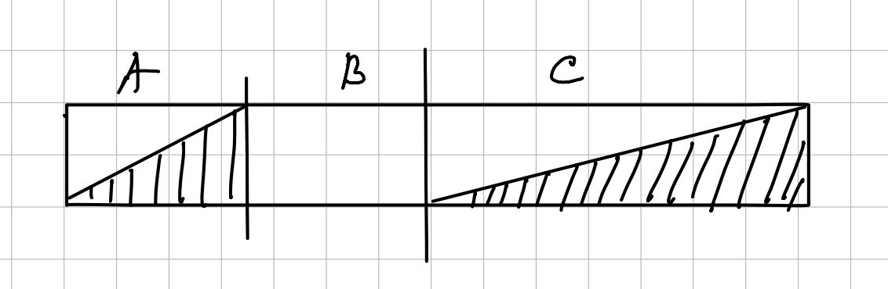

## Inplace MergeSort
### Идея
1. Чтобы отсортировать массив с помощью Inplace Merge Sort разделим его пополам. И отсортируем правую половину (С) запустив обычный Merge Sort от нее, а в качестве буффера используем левую половину. 
2. Далее разделим напополам левую часть и отсортируем ее правую половину (А), так же с помощью обычного Merge Sort, в качестве буффера используем левую четверть. Получим, что у нас есть два отсортированных кусочка А и С, размерами 1/2 и 1/4 исходного массива. И неотсортированная четверть В. 
3. Тогда можно запустить InplaceMerge А и В, используя в качестве буффера С. Т.е изначально два указателя "откуда читаем" указывают на начала массивов А и С, а указатель "куда пишем" – на массив В.  
Чтобы "писать" элементы будем использовать swap, чтобы ничего не потерять. Элементы А и С не наложатся друг на друга, тк если мы заполнили полностью пространство массива В, то у нас кончился массив А и элементы С просто останутся на месте. А если заполним все пространство элементами С, то валидное место для письма просто "переедет" на уже рассмотренные элементы С. 
4. После этого получаем отсортированную часть длинной (|A| + |C|) и неотсортированную часть слева длинной |В|. Повторим пункты 2-3 пока неотсортированная часть не станет длинной <=2. И тогда уже просто за линию вставим оставшиеся элементы в массив. 

### Асимптотика.
#### Слияние 
n – длина исходного массива. 
На каждой итерации неотсортированная часть нашего массива уменьшается хотя бы в 2 раза, значит таких итераций произойдет не более log(n). На каждой итерации выполняется InplaceMerge сложности O(n) (как обычный merge только элементы меняем местами)
Значит итоговая асимптотика O(n * log(n) + n (на вставку последних элементов)) = O(n * log(n))

#### Сортировки
Сортируются массивы размерами $\frac{N}{2^k}$, где $k \in \overline{1, \log_2 N}$.

$
\sum_{k=1}^{\log_2 N} \frac{N}{2^k} \log \frac{N}{2^k} \leq \sum_{k=1}^{\log_2 N} \frac{N}{2^k} \log N = N \log N \cdot \sum_{k=1}^{\log_2 N} \frac{1}{2^k} \leq N \log N
$